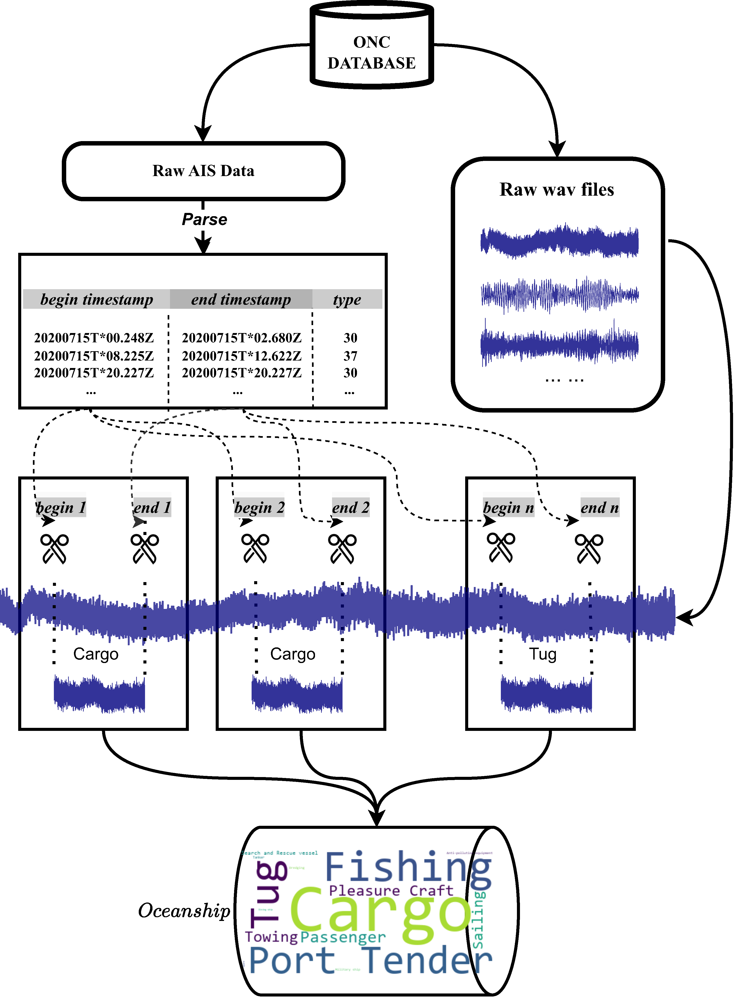

# Oceanship: A Large-Scale Dataset for Underwater Audio Target Recognition
<!-- 
 -->

  

The recognition of underwater audio plays a significant role
in identifying a vessel while it is in motion. Classifying underwater vessels involves training a network to extract features from audio data and
predict the vessel type. The current UATR dataset exhibits shortcomings in both duration and sample quantity. In this paper, we propose
Oceanship4, a large-scale and diverse underwater audio dataset. This
dataset comprises 15 categories, spans a total duration of 65 hours, and
includes comprehensive annotation information such as coordinates, velocity, vessel types, and timestamps. We compiled the dataset by crawling
and organizing original communication data from the Ocean Communication Network (ONC5) database between 2021 and 2022. While audio
retrieval tasks are well-established in general audio classification, they
have not been explored in the context of underwater audio recognition.
Leveraging the Oceanship dataset, we introduce a baseline model named
Oceannet for underwater audio retrieval. This model achieves a recall at
1 (R@1) accuracy of 67.11% and a recall at 5 (R@5) accuracy of 99.13%
on the Deepship dataset.

# Oceanship are available here:
- Oceanship(FG.) version: https://pan.baidu.com/s/19-K_QNvINT-ZlfHzd0HuSw password: 2fme 

- Oceanship(Full) version(28GB): https://pan.baidu.com/s/1FzqxKmmENbWzJUJafg9i7Q password: 8igj 

- Oceanship(CG.) version: We will not upload Oceanship(CG.), but you can get by doing: Oceanship(Full) - Oceanship(FG.).

# Data-fetching from ONC is coming soon
